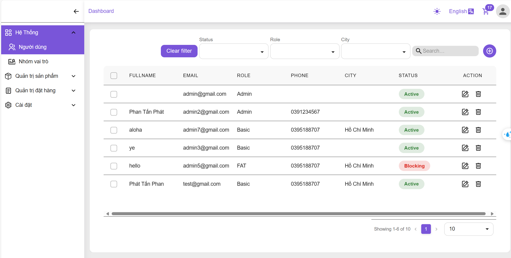
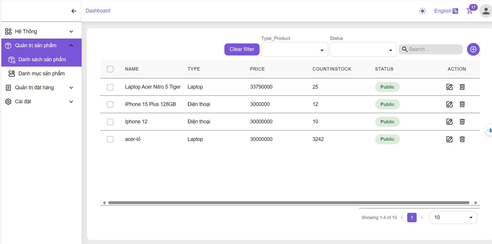
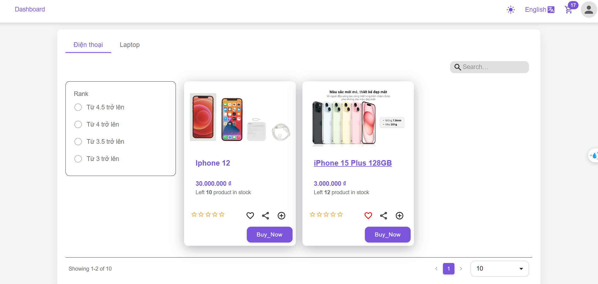
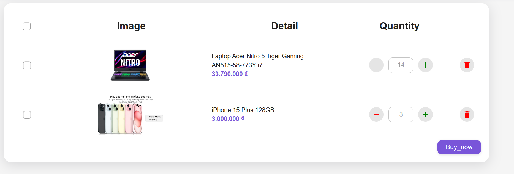
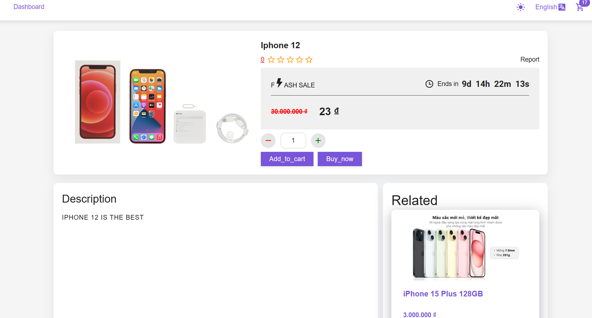

# Shop App

## Overview

This project is a fully-featured e-commerce app built with the following technologies:

- **React-Hook-Form**: For data validation.
- **React-Redux and redux-thunk**: Used to save data in the store, manage CRUD status, messages, and loading states.
- **Context API**: For managing the current user data.
- **Material UI (MUI)**: For layout and styling, including the DataGrid component to display and manage CRUD operations.
- **InstanceAxios**: Checks for token expiration on each request.
- **LocalStorage**: For token storage and persistence.

## Features

1. **User Management**: Allows for CRUD operations on user data.
2. **Product Management**: Provides a table layout for easy management of product details.
3. **Home Page**: Displays a list of available products and a welcome message.
4. **Cart Page**: Enables users to view and manage items in their cart.
5. **Product Detail Page**: Shows detailed information about a selected product.

## Screenshots

### User Management

### Product Management

### Home Page

### Cart Page

### Product Detail Page

